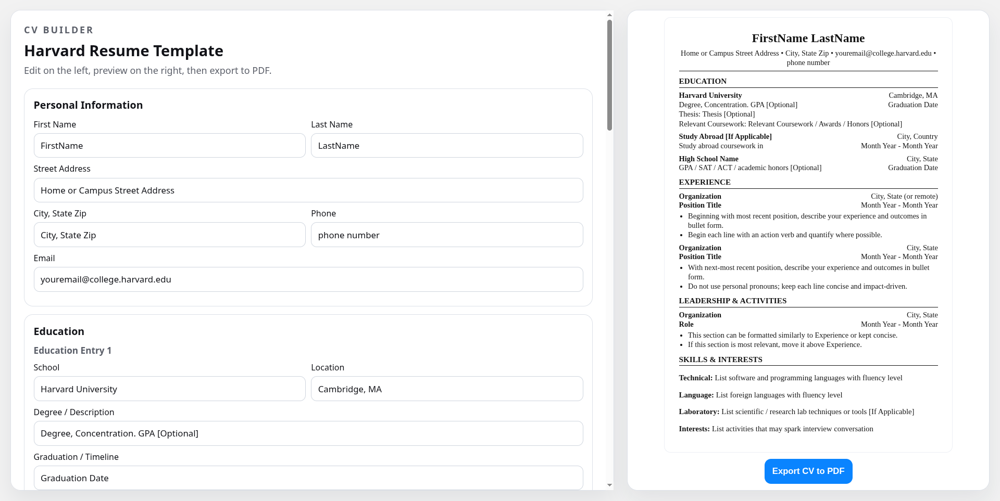

# Curriculum Vitae Builder

A React + Vite web app for building a Harvard-style CV with live preview and one-click PDF export.

## Features

- Live split-view editing: form on the left, CV preview on the right
- Harvard-style CV layout with pre-filled example content
- Optional section visibility toggles for preview and export
- PDF export with A4 formatting using `jsPDF`

## Tech Stack

- React
- Vite
- jsPDF
- Lucide React
- ESLint

## How To Use

1. Fill out and edit your details in the form.
2. Use the eye icons to show or hide optional sections.
3. Review the result in the live preview panel.
4. Click `Export CV to PDF` to generate and download your CV.
